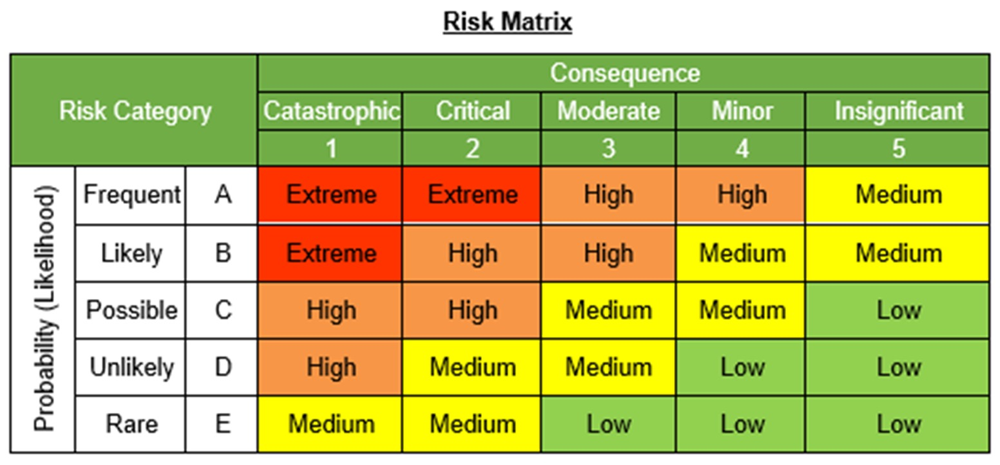
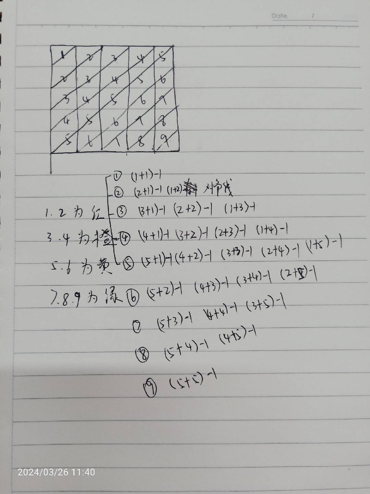

# 算法

## 工作中的算法

算风险等级，二维表格，每个维度5个等级，根据维度值得出最终等级，需求如图



抽象为正方形模型，分析如图：



规律为：

```javascript
const cellValue = risk_probability + risk_consepuence - 1
let riskValue = cellValue <= 2 ? 1 : (cellValue <= 4 ? 2 : (cellValue <= 6 ? 3 : 4))
```
