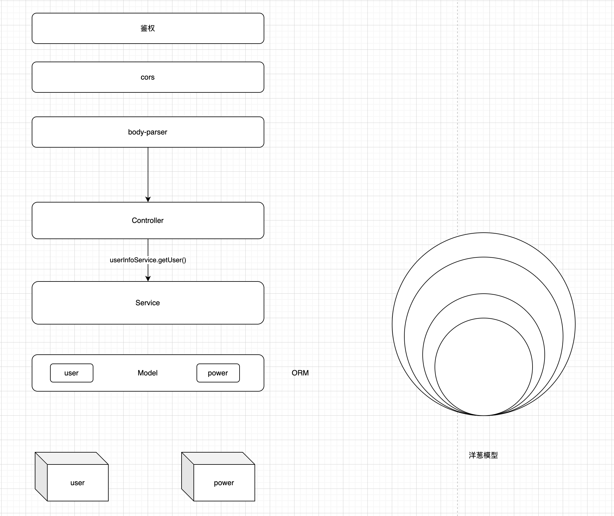

# ES实战

svelte / express / koa / decorator

## Svelte 的前端

体验下svelte写一个项目，熟悉下其语法，如循环 `{#each arr as item} {/each}`

## 装饰路由 decorator

- **装饰器的本质，是对类的行为的改变**，在代码编译时发生的，也不是运行时
- 编译器执行的函数

通过收集controllers，体会下装饰器的用途

## 全局安装工具

`npm install nodemon -g`
`npm install -g rollup`

## koa & express



### epress

express: node端，有一个 http 的模块（基于 net 的模块）（eventEmitter / stream 的模块）。
是一个后端框架

洋葱模型：express.js 从上往下，再从下往上。当/访问时，打印顺序为

```bash
quering start 1
quering start 2
quering start 3
quering end 3
quering end 2
quering end 1
```

```js
// express.js
const express = require('express')

const app = express()
const PORT = 3000

app.use((req, res, next) => {
  console.log('quering start 1')
  next()
  console.log('quering end 1')
})

app.use((req, res, next) => {
  console.log('quering start 2')
  next()
  console.log('quering end 2')
})

app.use((req, res, next) => {
  console.log('quering start 3')
  next()
  console.log('quering end 3')
})

app.get('/', (req, res) => {
  res.send('hello grace')
})

app.listen(PORT, () => {
  console.log(`Example listening on port ${PORT}`)
})
```

```java
// 数据结构例子
public class User {
  private int id
  private String name

  public ArrayList<User> getUsers () {

  }
}
```

### koa

vite1 koa
vite2 connect

koa 是一个后端框架，是由express原班人马打造的，主要是轻量，插件分离出去了。

同样是洋葱模型，同上。koa.js
自言自语：
console.log()的东西，都是在node端看到，不在客户端（浏览器端），因为它是服务端的。

```js
// koa.js
const Koa = require('koa')

const app = new Koa()
const PORT = 3000

app.use(async (ctx, next) => {
  console.log('quering start 1')
  next()
  console.log('quering end 1')
})

app.use(async (ctx, next) => {
  console.log('quering start 2')
  next()
  console.log('quering end 2')
})

app.use(async (ctx, next) => {
  console.log('quering start 3')
  next()
  console.log('quering end 3')
})

const main = ctx => {
  ctx.body = 'hello grace'
}

app.use(main)
app.listen(PORT, () => {
  console.log(`Example listening on port ${PORT}`)
})
```

koa-server.js
写一个请求

```js
// koa-server.js
const Koa = require('koa')
const Router = require('koa-router')

const app = new Koa()
const router = new Router()
const PORT = 3000

router.get('/api', (ctx, next) => {
  ctx.type = 'application/json'
  ctx.body = {
    data: 'hello, grace'
  }
})

app.use(router.routes())
app.use(router.allowedMethods({}))

app.listen(PORT, () => {
  console.log('koa server is running...')
})
```

## 项目实战 - 尝试在 node 中使用 esm

- type: 'module'
- .mjs

> 目标：<br />
> backend: 尝试使用 rollup 对 esm 打包，构建成 bundle, 然后实时执行这个 bundle。使用koa编写，提供接口供前端调用。<br />
> frontend: 使用svelte编写，调用后端接口并处理显示数据。

1）使用rollup编译后端代码
rollup.config.js
src/index.js -> dist/bundle.js
plugins: babel

2）nodemon 执行打包后的文件

3）yarn add core-js

阶段输出demo: koa-src/

### 4）使用装饰器收集 controller

```js
// bookController.js
import { Controller, RequestMapping, RequestMethod } from '../utils/decorators.js'

@Controller('/book')
export default class BookController {
  @RequestMapping(RequestMethod.GET, '/all')
  async getAllBooks (ctx, next) {
    ctx.body = {
      data: 'get all books'
    }
  }

  @RequestMapping(RequestMethod.GET, '/delete')
  async deleteBook (ctx, next) {
    ctx.body = {
      data: '删除book'
    }
  }
}
```

```js
// decorators.js
export const RequestMethod = {
  GET: 'get',
  POST: 'post',
  PUT: 'put',
  DELETE: 'delete',
  OPTION: 'option',
  PATCH: 'patch'
}

export const controllers = []

// 装饰器的本质，是对类的行为的改变，在代码编译时发生的，也不是运行时
// 编译器执行的函数
export function Controller (prefix = '') {
  return function (target) {
    // 给 controller 添加路由的前缀
    console.log('给 controller 添加路由的前缀: ', target)
    target.prefix = prefix
  }
}

export function RequestMapping (method = '', url = '') {
  return function (target, name, descriptor) {
    // 如果没有定义 url, 就以函数名称作为借口
    let path = url || name

    controllers.push({
      url: path,
      method: method,
      handler: target[name],
      constructor: target.constructor
    })
  }
}
```

### 5）对接svelte前端联调

5-1）初始化一个 svelte app, 使用路由 [svelte-spa-router](https://github.com/ItalyPaleAle/svelte-spa-router)
。加了路由后要重启服务。

```bash
# https://www.svelte.cn/
# 这个模板不再维护了，本次体验使用此模板建的项目，编译为rollup
npx degit sveltejs/template svelte-app

# https://svelte.dev/
# https://kit.svelte.dev/
# 最新是使用svelteKit来搭项目，编译为vite
npm create svelte@latest my-app
```

```svelte
<script>
import Router from 'svelte-spa-router'
import { routes } from './routes.js'
</script>

<Router {routes} />
```

> TODO 尝试了设置多个页面，以及动态路由，但除了首页，另外设置的页面访问失败

```js
import Home from './views/Home.svelte'
import About from './views/About.svelte'
import { wrap } from 'svelte-spa-router/wrap'

export const routes = {
  '/': Home,

  '/book/*': wrap({
    asyncComponent: () => import('./views/About.svelte')
  }),
  '/about': About
}
```

5-2）请求后端数据

[Tutorial - API routes - GET handlers](https://learn.svelte.dev/tutorial/get-handlers)

```svelte
<script>
// 要给数组初始值，否则无法使用#each解析
let books = []
async function getData() {
  const response = await fetch('http://localhost:3000/book/all');
  let result = await response.json();
  console.log(result)
  books = result.data
}
</script>
```

后端koa加个cors解决请求CORS，`app.use()`

```js
// cors
app.use(async (ctx, next) => {
  ctx.set('Access-Control-Allow-Origin', '*')
  ctx.set('Access-Control-Allow-Headers', 'Content-Type, Content-Length, Authorization, Accept, *')
  ctx.set('Access-Control-Allow-Methods', 'GET, POST, PUT, DELETE, OPTIONS')
  ctx.set('Content-Type', 'application/json;charset=utf-8')
  if (ctx.request.method.toLowerCase() === 'options') {
    ctx.state = 200
  } else {
    await next()
  }
})

```

5-3）处理数据及显示

[svelte语法，详见文档及教程](https://learn.svelte.dev/tutorial/each-blocks)

```svelte
<ul class="list">
  {#each books as book (book.id)}
  <li key="{book.id}" class="list-item">
    <div>{book.id}</div>
    <div>{book.name}</div>
    <div>{book.author}</div>
    <div>{book.publish}</div>
  </li>
  {/each}
</ul>
```

补充：（此次体验暂未使用）

[tailwindcss - 样式库](https://tailwindcss.com/docs/installation)

[smelte - 基于tailwindcss的 Material 风格样式 for svelte](https://smeltejs.com/)

```svelte
<!-- 样式类使用 分列 -->
w-1/12
w-1/12
w-8/12
w-1/12
```

至此基本完成一个含前后端的小项目，暂不涉及数据库。输出：`es6-proj/back_end, es6-proj/svelte-app`
