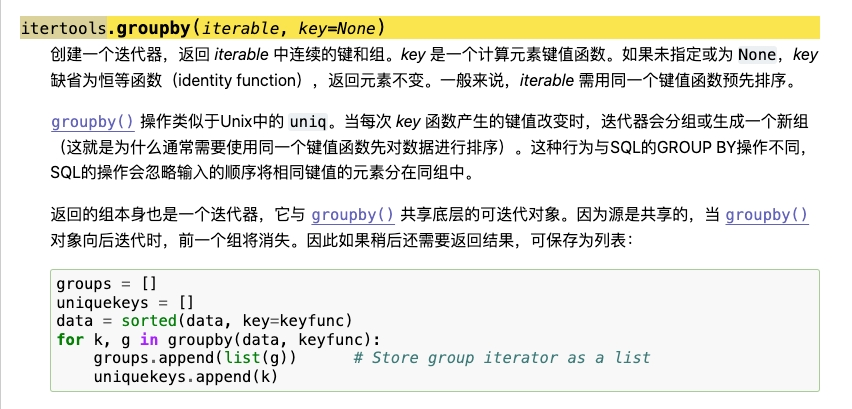
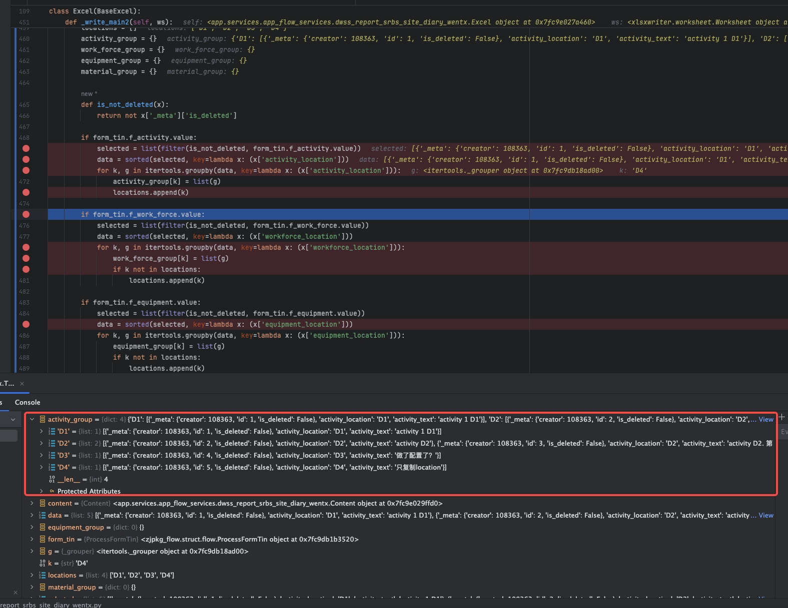
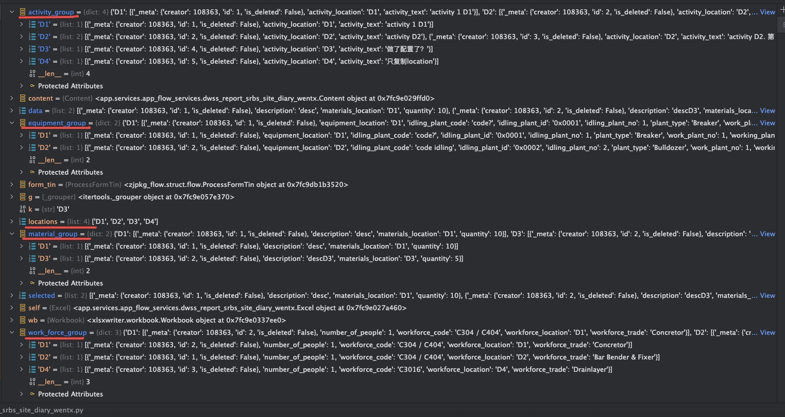
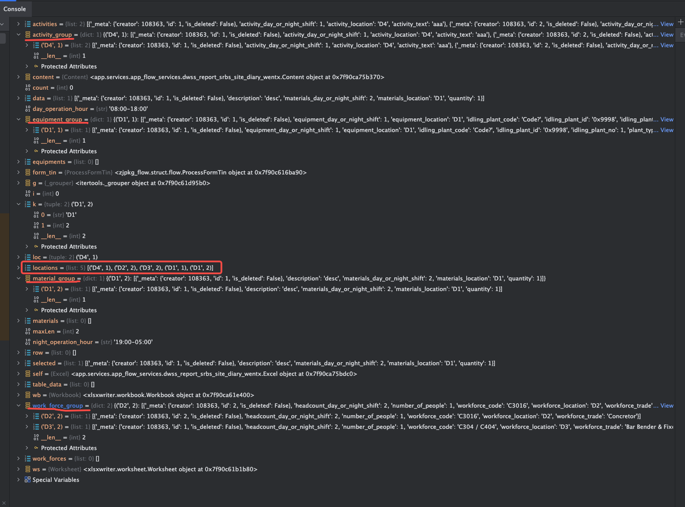

# python

自2024-04月底开始，公司要求做报告导出，使用python，导出形式有excel, pdf, 到目前（7月），期间做导出工作接触了一些python, xlsxwriter的基础知识，稍微做一下笔记吧。

## xlsxwriter

概念：

- workbook 整个文件
- worksheet 表，workbook.add_worksheet，表的命名只能在添加时赋予，不能后续set_name
- format 单元格格式，workbook.add_format
- 条件化格式，worksheet.conditional_format 需要指定具体表的区域，必须设置条件类型，重复设置的区域，只会取其中一个，好像是第一个设置的
- worksheet.write_row 单元格基础填写内容
- worksheet.merge_range 合并单元格
- worksheet.add_table 添加表格，表头只能一行，当前似乎无法设置多行合并的表头，可以设置表头不显示，另外写表头; table的样式，不知道内置的style都支持哪些名字，对应什么样式，可以设置无，再结合条件化格式来写表格样式，比如实线边框
- 其他图表，暂未涉及，查 worksheet的方法即可

- [xlsxwriter文档主入口](https://xlsxwriter.readthedocs.io/contents.html)
- [examples - table](https://xlsxwriter.readthedocs.io/example_tables.html#)
- [table属性说明](https://xlsxwriter.readthedocs.io/working_with_tables.html#header-row)
- [条件化格式文档](https://xlsxwriter.readthedocs.io/working_with_conditional_formats.html#the-conditional-format-method)

## python的一些基础知识

### groupby



是 itertools 库的一个方法，可以取一个字段或多个字段作为key, 取多个字段时，key是Tuple（元组）形式，可通过key[0],key[1]这样来访问分组字段值。

groupby处理后，把数据存为 { key: values } 形式，是这样的：







[itertools.groupby](https://docs.python.org/zh-cn/3/library/itertools.html#itertools.groupby)

### strftime 格式化时间

- [strftime](https://www.runoob.com/python/python-date-time.html)

### enumerate

遍历需要索引时，用enumerate包起来

```python
for index, item in enumerate(content.early_warning_category):
    self.write_row(f'E{row + index}:E{row + index}', index + 1, base_fmt)
    self.write_row(f'F{row + index}:H{row + index}', item[1], base_fmt)
```

### 一些语法

- python的语法，跟javascript，似乎很多是反过来的，比如上述遍历，js是 item, index, py则反过来了。
- join, js是 arr.join('、'), py 又反过来：'、'.join(arr)
- import库，js是 import Xxx from xxx, py: from xxx import Xxx
- dict 不能使用 dict.xxx 要使用 dict['xxx'], 且xxx属性必须存在；若不确定属性是否存在，要使用get：dict.get('xxx', default_value)
